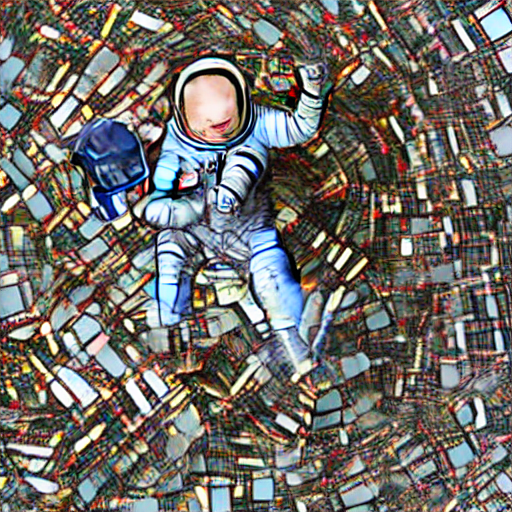
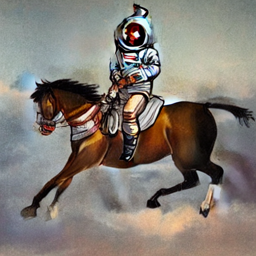
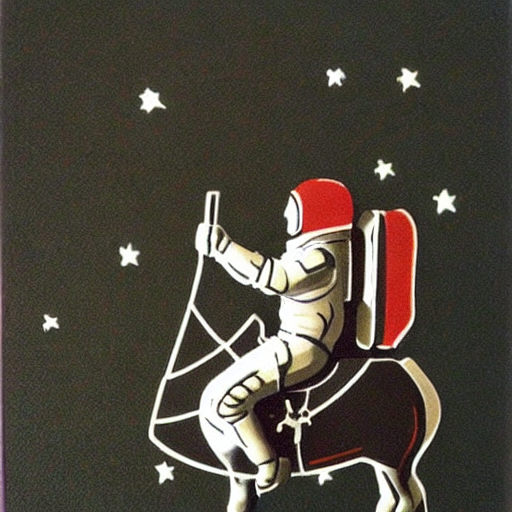

# Entrega del módulo "Modelos de Generación de Imagen"

Trabajo realizado por Daniel Gómez.

## Archivos del repositorio

El repositorio consta de 3 scripts:

- `train_lora.py`. Entrenamiento con LoRa.
- `train_normal.py`. Entrenamiento común, pero que no me funciona por la memoria.
- `infer_lora.py`. Inferencia con el modelo entrenado y publicado en HF.

Para entrenar y hacer inferencia será necesario instalar las dependencias del `pyproject.toml` (gestionado con UV).

En la primera ejecución de `train_lora.py` se creará un archivo `latents.pkl` con las latentes almacenadas. En la siguiente iteración tomará este archivo y no lo volverá a calcular.

## Comentarios

He intentado entrenar de manrea convencional, tal y como lo expuesto en el notebook de la segunda clase. Sin embargo, me quedaba corto de memoria, incluos con un batch_size de 1. Tomé una serie de medidas (con ayuda de algunas IAs que me recomendaran):

1. Precomputar las latentes para evitar tener tanto el VAE como la UNET en memoria. Una vez calculados, nos podemos olvidar del VAE.

2. Entrenar con LoRa. Se pasaban de unos 890M de parámetros a unos 800k aproximadamente. Si no recuerdo mal, era un ~0.09% de parámetros finetuneados.

## Resultados

### Modelo

El modelo generado (LORA) está en el siguiente repo de Hugging Face: `danigr7/unet-lora-finetuned`. Es público, por lo que no debería haber problema en cargar los archivos.

### Imágenes

Se ha hecho inferencia con 3, 10 y 50 steps de inferencia. En la tabla se muestran las imágenes resultantes para el prompt "an astronaut riding a horse".

| Steps = 3 | Steps = 10 | Steps = 50 |
|----------|----------|----------|
|  |  |  |

Vemos como la segunda imagen parece ligeramente más realista pero la tercera parece más adpatada a los estilos con los que se ha finetuneado la Unet.

## Dataset

Uno de las complejidades de la práctica era el preprocesamiento del dataset. Concretamente, el tratamiento de las imágenes.

La información que queremos está en las columnas "1600px" y "info_alt". En "1600px" están las imágenes, con un ancho fijo de 1600 px y un alto variable. Estas imágenes pueden estar en blanco y negro o en color.

Para poder usar las imágenes, debemos hacer primero un recorte (crop). Lo trivial es usar un transforms.CenterCrop de torchvision, pero esta transformada no permita fijar el tamaño del recorte de forma dinámica, y en nuestro caso es necesario debido a que dependemos del lado de la imagen de menor tamaño. Otras alternativas son:

- hacer un CenterCrop directamente de 512x512 --> podría quedar mucha información fuera si la imagen es muy grande + (creo que) no funcionaría si la imagen tiene un alto menor de 512.
- hacer un resize a 512 en ambos lados directamente --> deformaría la imagen.

Creamos una transformación propia para que haga un recorte cuadrado en el centro de la imagen usando la menor longitud de la imagen como tamaño. Si el ratio ancho/alto es muy grande, es posible que se pierda información relevante con respecto a la descripción de "info_alt". Asumimos que la principal cantidad de información de la imagen se sitúa en el centro de la misma. Esto no siempre se va a cumplir, pero es la opción más sencilla y, en este caso, puede ser suficiente.

Por otro lado, dado que hay imágenes a color y en escala de grises, unificaremos en escala de grises, para no confundir al modelo con distintos estilos.
